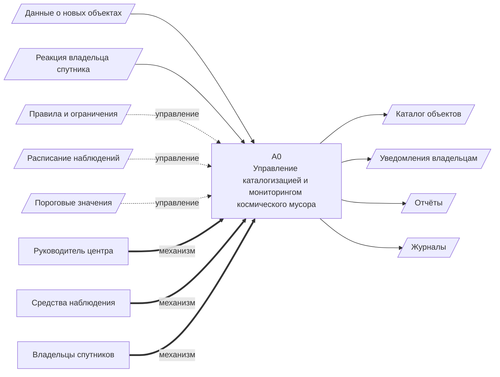

# 1. IDEF0: контекстная диаграмма (A0)

Mermaid не поддерживает IDEF0 нативно, поэтому блок A0 показан флоуграфом: **вход** — слева, **управление** — сверху, **механизм** — снизу, **выход** — справа.

Исходный рисунок: 

[← к диаграммам](README.md)
