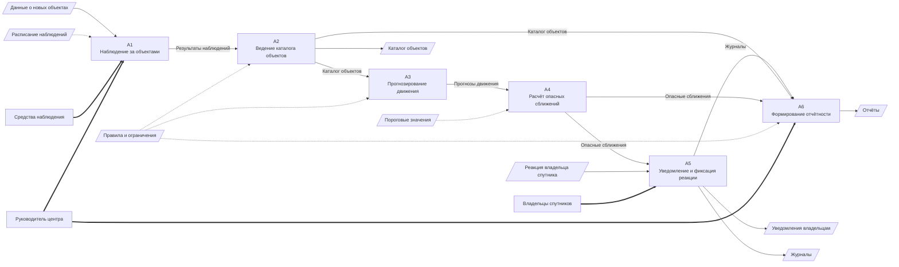

# 2. IDEF0: декомпозиция A0

```mermaid
flowchart LR
    NEW[/Данные о новых объектах/] --> A1
    SCH[/Расписание наблюдений/] -.-> A1
    A1["A1<br/>Наблюдение за объектами"] -->|Результаты наблюдений| A2
    A2["A2<br/>Ведение каталога объектов"] -->|Каталог объектов| A3
    A3["A3<br/>Прогнозирование движения"] -->|Прогнозы движения| A4
    A4["A4<br/>Расчёт опасных сближений"] -->|Опасные сближения| A5
    REACT[/Реакция владельца спутника/] --> A5
    A5["A5<br/>Уведомление и фиксация реакции"] -->|Журналы| A6
    A2 -->|Каталог объектов| A6
    A4 -->|Опасные сближения| A6
    A6["A6<br/>Формирование отчётности"] --> REP[/Отчёты/]
    A5 --> NOTE[/Уведомления владельцам/]
    A5 --> LOG[/Журналы/]
    A2 --> CAT[/Каталог объектов/]

    RULES[/Правила и ограничения/] -.-> A2
    RULES -.-> A3
    RULES -.-> A6
    THR[/Пороговые значения/] -.-> A4

    TOOLS[Средства наблюдения] ==> A1
    HEAD[Руководитель центра] ==> A1
    HEAD ==> A6
    OWN[Владельцы спутников] ==> A5
```

Исходный рисунок: 

[← к диаграммам](README.md)
