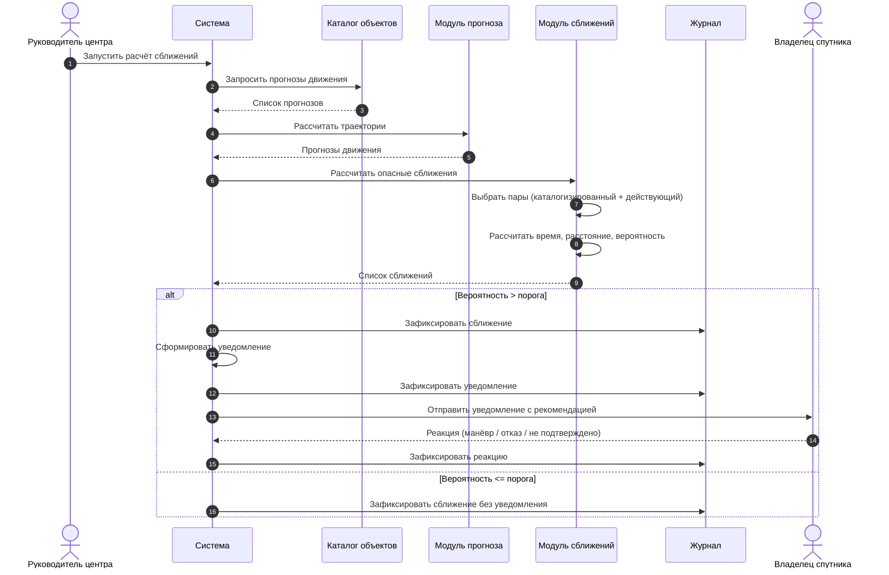

# 4. Процесс «Расчёт опасного сближения и уведомление владельца»

## Mermaid

## PlantUML

Исходник: [04-sequence-conjunction.puml](04-sequence-conjunction.puml). Рисунок из отчёта:

[← к диаграммам](README.md)
