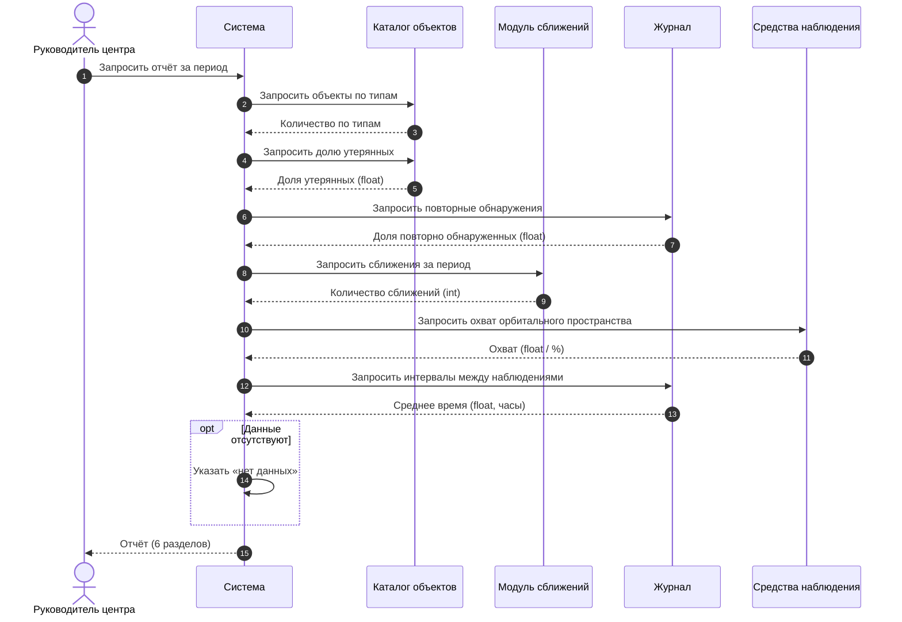

# 5. Процесс «Формирование отчёта руководителем центра»

## Mermaid

## PlantUML

Исходник: [05-sequence-report.puml](05-sequence-report.puml). Рисунок из отчёта:

Требования к отчёту — в [README проекта, раздел 5](../../README.md#5-отчётность).

[← к диаграммам](README.md)
