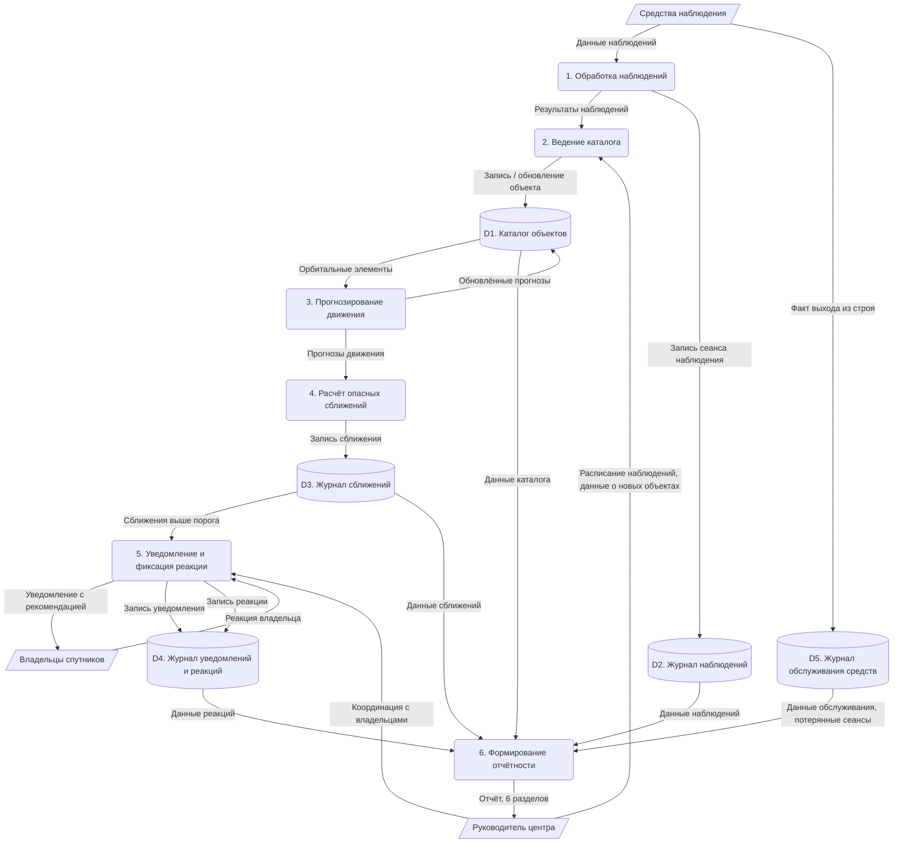

# 6. DFD: потоки данных

Обозначения: прямоугольник со скруглением — процесс, цилиндр — хранилище (D), трапеция — внешняя сущность.

```mermaid
flowchart TD
    T[/Средства наблюдения/]
    H[/Руководитель центра/]
    O[/Владельцы спутников/]

    P1(1. Обработка наблюдений)
    P2(2. Ведение каталога)
    P3(3. Прогнозирование движения)
    P4(4. Расчёт опасных сближений)
    P5(5. Уведомление и фиксация реакции)
    P6(6. Формирование отчётности)

    D1[(D1. Каталог объектов)]
    D2[(D2. Журнал наблюдений)]
    D3[(D3. Журнал сближений)]
    D4[(D4. Журнал уведомлений и реакций)]
    D5[(D5. Журнал обслуживания средств)]

    T -->|Данные наблюдений| P1
    P1 -->|Результаты наблюдений| P2
    P1 -->|Запись сеанса наблюдения| D2
    P2 -->|Запись / обновление объекта| D1
    D1 -->|Орбитальные элементы| P3
    P3 -->|Обновлённые прогнозы| D1
    P3 -->|Прогнозы движения| P4
    P4 -->|Запись сближения| D3
    D3 -->|Сближения выше порога| P5
    P5 -->|Уведомление с рекомендацией| O
    O -->|Реакция владельца| P5
    P5 -->|Запись уведомления| D4
    P5 -->|Запись реакции| D4
    T -->|Факт выхода из строя| D5
    H -->|Расписание наблюдений, данные о новых объектах| P2
    H -->|Координация с владельцами| P5

    D1 -->|Данные каталога| P6
    D2 -->|Данные наблюдений| P6
    D3 -->|Данные сближений| P6
    D4 -->|Данные реакций| P6
    D5 -->|Данные обслуживания, потерянные сеансы| P6
    P6 -->|Отчёт, 6 разделов| H
```

Исходный рисунок: 

[← к диаграммам](README.md)
