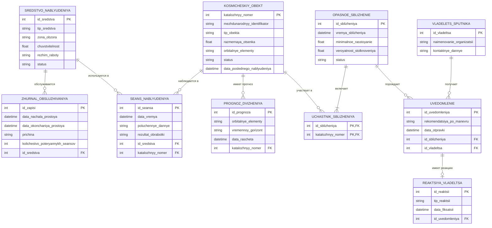

# 7. Модель данных (IDEF1X / ER)

## Mermaid (erDiagram)

> В Mermaid `erDiagram` имена сущностей и атрибутов записаны транслитом: кириллица в идентификаторах этого типа диаграмм поддерживается нестабильно. Соответствие: `SREDSTVO_NABLYUDENIYA` — Средство_наблюдения, `KOSMICHESKIY_OBEKT` — Космический_объект и т. д.

## PlantUML

Исходник с кириллическими именами: [07-data-model.puml](07-data-model.puml). Рисунок из отчёта:

[← к диаграммам](README.md)
